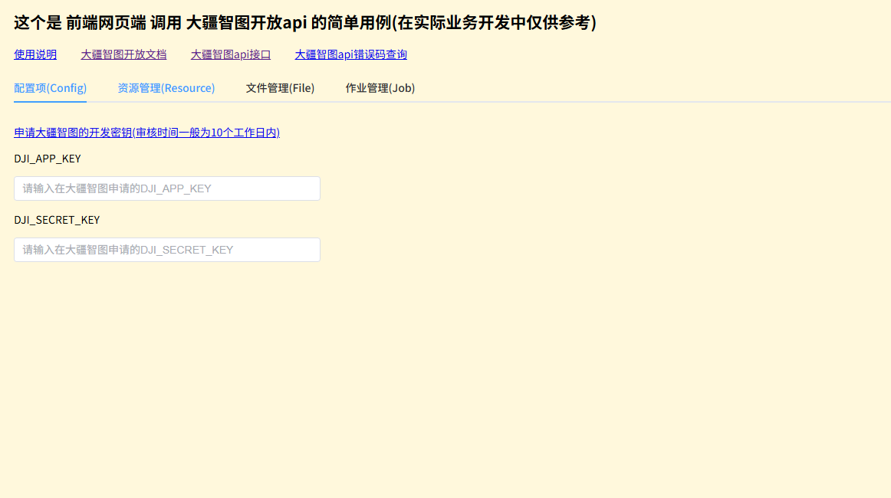
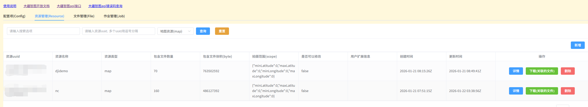

# 安装依赖
  pnpm install
# 运行
  pnpm run dev

# 预览图




# 大疆智图
> 大疆智图是一款以摄影测量技术为核心的的三维重建软件，可支持各类可见光精准高效二三维重建、大疆激光雷达的数据处理。 大疆智图与大疆行业无人机和负载可形成完美搭配，形成面向测绘、电力、应急、建筑、交通、农业等垂直领域完整的应用解决方案
>
> 官网：https://enterprise.dji.com/cn/dji-terra

# 大疆智图开放api
> 官网： https://developer.dji.com/cn/terra-api/
>
> 司空2： https://fh.dji.com/login
>
> Api使用文档： https://developer.dji.com/doc/terra_api_tutorial/cn/
>
> 接口swagger文档： https://developer.dji.com/doc/terra_api_tutorial/cn/api/terra/

## 接入流程
1. 申请试用(申请审核一般为10个工作日内)
2. 审核通过后,在控制台拿到 App Key 和 Secret Key
3. 阅读大疆智图Api文档了解开发流程
4. 官方提供的代码示例为 shell脚本或者python脚本，前端浏览器端使用时需要提前进行代码转换为JS
5. 按照官网实例文档的步骤进行开发
6. 最终导出的文件上传到大疆司空2平台的模型库中或自己搭建的服务，形成线上访问地址

## 开发流程
>重点： 请求封装，大疆智图在请求时做了加密处理，需要特殊封装,以下为封装示例
```javascript 
export const request = async ({
  url,
  httpMethod = 'post',
  data,
  contentType = "application/json;charset=UTF-8",
  headers = {}
}) => {
  const newData = httpMethod === 'get' ?  filterNullUndefined(data) : data

  if (DJI_APP_KEY.value == '' || DJI_SECRET_KEY.value == '') {
    ElMessage.error('请先配置APPKEY和APPSECRET')
    return Promise.reject()
  }
  const paramsStr = objectToUrlParmasString(newData)
  const URL = `/terra-rescon-be${url}${httpMethod === 'get' ? paramsStr ==='?' ? '' : paramsStr : ''}`;
  const xDate = new Date().toUTCString();
  const payloadString = JSON.stringify(newData);
  const utf8Payload = CryptoJS.enc.Utf8.parse(payloadString);
  const sha256Payload = CryptoJS.SHA256(utf8Payload);
  const digest = CryptoJS.enc.Base64.stringify(sha256Payload);
  const contentToSign = `x-date: ${xDate}\n@request-target: ${httpMethod} ${URL}\ndigest: SHA-256=${digest}`;  // 注意使用的是x-date
  const requestSignature = calculateSignature(contentToSign, CryptoJS.enc.Utf8.parse(DJI_SECRET_KEY.value));
  const authorization = `hmac username="${DJI_APP_KEY.value}", algorithm="hmac-sha256", headers="x-date @request-target digest", signature="${requestSignature}"`  // 注意使用的是x-date

  return new Promise((resolve, reject) => {
    axios(URL, {
      method: httpMethod,
      baseURL: 'api/',
      timeout: 60000,
      headers: {
        'X-Date': xDate,  // 官方使用的Date,但在浏览器中Date是请求头关键词，不能手动配置，所以使用其他名称，需注意要和前面加密时保证名称一样
        'Digest': `SHA-256=${digest}`,
        'Authorization': authorization,
        'Content-Type': contentType,
        ...headers,
      },
      data: payloadString
    }).then(res => {
      resolve(res.data.data)
    }).catch((err) => {
      reject(err)
      ElMessage.error(err.response.data.result.desc || err.message)
    })
  })
}
```


1. 通过请求获取Token, 返回结果必定包含以下几个参数：
```javascript
accessKeyID   // 阿里云oss  accessKeyID
secretAccessKey // 阿里云oss  secretAccessKey
sessionToken //  阿里云oss STS
region  // 阿里云oss region
cloudBucketName  // 大疆智图生成的阿里云oss Bucket
storePath  // 上传路径，后续上传文件时需要使用这个路径
callbackParam  // 这个在后续 阿里云oss存储文件 关联 大疆智图resource 时需要用到 

// 返回示例
{ "cloudName": "ali_oss", 
  "accessKeyID": "STS.NTabcmpXtdmYgo413ajScooPA", 
  "secretAccessKey": "2LYCypXxRMWG8aUqbLRwGbdzJ5eGY5xG9RHtE5GjR3nS", 
  "sessionToken": "CAIStwN1q6Ft5B2yfSjIr5fUKdnZnYdV0nmlW7fkblqpoV4QdV", 
  "region": "oss-cn-hangzhou", 
  "cloudBucketName": "hz-terra-be-prod",  // 大疆智图创建的Bucket 一般是这个名称
  "callbackParam": "ek1zZ3NpZTg5ZXRDVjA3WjBnYm1pMDl", 
  "storePath": "0f-4b17-97c2-c33a9df007d6/tmp/ab-4475-a8d2-6d4e62d31e7b/{fileName}", 
  "expireTime": 1711114461 
}
```
2. 安装阿里云oss SDK,通过上方拿到的信息创建oss client
```javascript
	npm install ali-oss  // oss sdk
	
 const ossClient = new Oss({....})

```
3. 上传文件到阿里云OSS（注意：上传一个文件成功后会返回一个成功信息，需要存储记录，后续流程会使用到）
```javascript
// 大疆智图提供了文件素材，可查阅下载

// 文件上传成功后返回示例
{
    "name": "0f-4b17-97c2-c33a9df007d6/tmp/18ab-4475-a8d2-6d4e62d31e7b/DJI_20230403145035_0302_V.JPG",
    "url": "http://hz-terra-be-prod.oss-cn-hangzhou.aliyuncs.com/97c2-c33a9df007d6/tmp/18ab-4475-a8d2-6d4e62d31e7b/DJI_20230403145035_0302_V.JPG",
    "res": {
        "status": 200,
        "statusCode": 200,
        "headers": {
            "content-length": "0",
            "etag": "\"ADBDFDA2C132CCA65C155E8767E\"",   // 重点关注，需要存储记录
            "x-oss-request-id": "1CD8BCF038370353CD"
        },
        "size": 0,
        "aborted": false,
        "rt": 2154,
        "keepAliveSocket": false,
        "data": {
            "type": "Buffer",
            "data": []
        },
        "requestUrls": [
            "http://hz-terra-be-prod.oss-cn-hangzhou.aliyuncs.com/7-97c2-c33a9df007d6/tmp/18ab-4475-a8d2-31e7b/DJI_20230403145035_0302_V.JPG"
        ],
        "timing": null,
        "remoteAddress": "",
        "remotePort": ""
    }
}
```
4. 创建resource,关联已经上传到阿里云OSS的文件（注意：智图建模需要先将文件上传到oss存储，然后关联resource，这样才能在后续建模中查询到文件，个人理解resource 其实和数据库一样，用来存储oss的文件信息）
```javascript
		// 做关联请求时，需要三个参数，为必传
{
 callbackParam, // 这个是最开始时获取Token拿到的参数
 resourceUUID, // 这个是创建的resource的uuid,在调用创建reource接口成功时会返回
 files:[   // 数组    这个是刚刚文件上传阿里云oss成功时返回的信息
	{
      "checksum": "string",  // 和etag填一样就可以
      "etag": "string",     // 文件上传成功后的信息里可以找到
      "meta": "string",    // 可不传
      "name": "string",   // 文件上传成功后的信息里可以找到
      "position": {   // 可不传
        "attitude": 0,
        "latitude": 0,
        "longitude": 0
      }
    }
  ]  
}
	
```
5. resource 的增、删、改、查通过官方接口文档自行查阅使用

6. 创建job,通过传入resource的uuid进行建模
```javascript
	
// 在创建job成功后会返回一个uuid，我们需要通过这个uuid  在接口中指定它来开始建模工作
// 开始建模的接口必传以下参数
{
 resourceUuid,  // 这个是 前面已经关联好oss文件的resource的uuid 
 type: 14,   // 建模类型   2D：14   3D: 15   LiDAR：13
 parameters: "{\"parameter\":{\"map_mode\":1,\"quality_level\":1,\"output_geo_desc\":{\"cs_type\":\"GEO_CS\",\"geo_cs\":\"EPSG:32650\",\"geo_cs_wkt\":\"\",\"override_vertical_cs\":\"\"}}}"   // 建模的配置信息， 必须为字符串
}


// 在job 开启工作后可以调用接使其停止

// job 工作结束后，如果成功的话会，通过使用这个job 的 uuid调用查询接口获取该job的信息，以下为返回示例
{
 "completedAt": "string",
 "createdAt": "string",
 "message": "string",
 "meta": "string",
 "name": "string",
 "originResourceUuid": "string",
 "outputResourceUuid": "string",  // 如果成功的话，这里job会自动创建一个新的reource ，  这个则是建模成功后的resource 的 uuid
 "parameters": "string",
 "percentage": 0,
 "pixels": 0,
 "remainSeconds": 0,
 "startedAt": "string",
 "status": 0,
 "type": 0,
 "updatedAt": "string",
 "uuid": "string"
}

```

7. job 的增、删、改、查通过官方接口文档自行查阅使用

8. 下载建模成功后的文件
```javascript
	// 通过上面拿到的 建模成功后的 resource uuid ,我们调用 resource 查询接口查询这个uuid,返回以下信息
 {
    "fileUuids": [   // 这个是所有建模处理后的文件的uuid
      "string"
    ],
    "inputJobUuids": [
      "string"
    ],
    "outputJobUuids": [
      "string"
    ],
    "summary": {
      "createdAt": "string",
      "downloadUsedTime": 0,
      "fileCount": 0,
      "meta": "string",
      "name": "string",  ,  // 它的名称格式为 output of job: 一个uuid, 这个uuid 就是上面job 的uuid
      "revisable": true,
      "scope": {
        "maxLatitude": 0,
        "maxLongitude": 0,
        "minLatitude": 0,
        "minLongitude": 0
      },
      "totalSize": 0,
      "type": "map",
      "updatedAt": "string",
      "uploadUsedTime": 0,
      "uuid": "string"
    }
  }
    
    
    
   // 而后我们通过上面拿到的fileUuids，去逐个通过file查询接口查询每一个uuid的文件信息，拿到这个文件在阿里云oss的存储地址，然后就可以下载 


